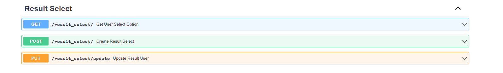

# Backend với WebAPI cho Hệ thống bầu chọn
Những điểm nổi bật của hệ thống
- FastAPI trong Python 
- MySQL
- Docker

## Setup

Đầu tiên cài đặt `Docker` và và `Docker Compose`


Sau khi cài đặt thì clone repository, đi vào thư mục `fastapi-for-vote-system` và chạy 2 câu lệnh phía dưới trên cmd để build ứng dụng
```bash
docker-compose build
docker compose up 
```

Nếu thành công thì WebAPI sẽ được chạy trên:

- API server: http://localhost:8000/docs
  
Trong MySQL Server đã có sẵn dữ liệu cho các bảng dùng cho việc test các API

## Cấu trúc dự án
Dự án sẽ bao gồm 2 folder chính là `mysql` và  `api`
  + `mysql`: chứa các cấu hình về mysql server
  + `api`: chứa source code của dự án

Trong folder `api` có các folder như:
  + `credentials`: Chứa file `.env` có Connection String để kết nối tới MySQL Server
  + `database`: Kết nối tới MySQL Server
  + `models`: Có các model của các bảng trong database
  + `schemas`: Có các schemas của các đối tượng
  + `crud`: Là các controller để thực hiện việc CRUD
  + `routers`: Chứa các router của API

## Mô tả database


 Database được thiết kế như sau:
  + Bảng `vote` chứa dữ liệu về các đợt bình chọn bao gồm các thông tin như id, tên cuộc bình chọn, ngày tạo, ngày bắt đầu, người tạo,... Có 4 loại bình chọn như là: 
      + Chọn 1 trong nhiều (`one_select`)
      + Chọn nhiều trong nhiều (`many_select`) 
      + Chọn đùng sai (`one_boolean`)
      + Chọn đúng sai nhiều trong nhiều (`many_boolean`)
  + Bảng `user` chứa các thông tin của user như tên, email, số điện thoại.
  + Bảng `option` sẽ chứa các tùy chọn của đợt bình chọn đó .
  + Bảng `result_select` sẽ chứa dữ liệu về việc người dùng có chọn option đó hay không trong đợt bình chọn có loại là `one_select` và `many_select` bằng việc lưu dưới dạng (`option_id`, `user_id`), nếu xuất hiện trong bảng thì có nghĩa là người dùng có chọn option đó.
  + Bảng `result_many_boolean` giống như bảng `result_select` nhưng lưu trữ dữ liệu kết quả bầu chọn cho đợt bầu chọn có loại là `many_boolean` và có thêm trường `answer` để chứa câu trả lời đúng sai cho option đó
  + Bảng `result_one_boolean` dùng cho đợt bầu chọn có loại là `one_boolean`

## API
Các api cho `user` bao gồm: tạo user, lấy thông tin tất cả user, lấy thông tin user theo `user_id`:


Các api cho `vote` bao gồm: tạo vote, lấy thông tin tất cả đợt vote, lấy thông tin đợt vote theo `vote_id`, cập nhật trạng thái và nội dung của đợt vote, thống kê kết quả vote và truy xuất thông tin của những người dùng đã tham gia vào đợt bình chọn:


Các api cho `option` bao gồm: tạo option cho đợt bình luận và lấy dữ liệu các option theo `vote_id`


Các api cho `result_select`, `result_one_boolean`, `result_many_boolean` bao gồm: tạo kết quả bầu chọn, cập nhật kết quả bầu chọn, lấy kết quả vote cho option đó 



